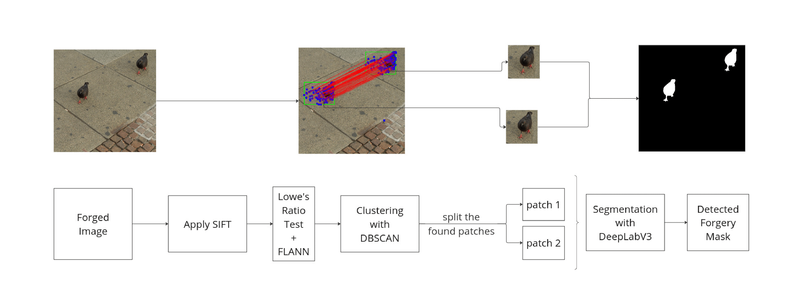

# Copy-Move Forgery Detection Using SIFT, DBSCAN, and DeepLabV3

This project is made for the course project of EE475, Fall 2024 semester. 
Project done by Serkan Hamdi Güğül (repo owner) and GÖksun Güney Küçük. Both had done equal contribution.

## Project Overview

With the widespread use of digital images in communication, social media, and forensic applications, ensuring the integrity and authenticity of visual content is critical. Copy-move forgery is a common manipulation technique where image regions are copied and pasted within the same image. This project explores a robust approach to detect such forgeries using:

1. **SIFT (Scale-Invariant Feature Transform)** for detecting keypoints and descriptors.
2. **DBSCAN (Density-Based Spatial Clustering of Applications with Noise)** for clustering matched keypoints.
3. **DeepLabV3** for precise segmentation of forged regions.

### Key Contributions

- **SIFT**: Detects distinctive keypoints invariant to scale, rotation, and partial affine transformations, ideal for identifying copied and pasted regions.
- **DBSCAN**: Reduces false positives by clustering keypoints and identifying dense regions of matches.
- **DeepLabV3**: Provides semantic segmentation for precise localization of forged patches.
- **Dataset**: The CoMoFoD (Image Database for Copy-Move Forgery Detection) dataset is used for evaluation.

## Methodology

### 1. Preprocessing
- Convert the input image to grayscale as SIFT operates on intensity values rather than color.

### 2. Feature Detection and Matching
- Apply **SIFT** to detect keypoints and compute descriptors.
- Use **FLANN-based matcher** (Fast Library for Approximate Nearest Neighbors) to match descriptors within the same image.
- Apply **Lowe's ratio test** to filter reliable matches and reduce false positives.

### 3. Clustering Matches
- Use **DBSCAN** to cluster the matched keypoints.
- Define thresholds for cluster size and minimum required matches to identify copy-move regions.

### 4. Forgery Segmentation
- Crop detected regions and pass them through **DeepLabV3** for semantic segmentation.
- Integrate the segmented patches into the original image to create a complete forgery map.

### 5. Visualization
- Draw rectangles around detected regions and visualize the connections between matched keypoints.
- Include the original image, forgery mask, and segmented results for clarity.

## Results
The algorithm was applied to 200 images from the CoMoFoD dataset. Examples of both high-performing and less successful results are provided for better understanding. The method demonstrates performance comparable to modern techniques for simple images in the dataset.

## References
[1] D. G. Lowe, ”Distinctive image features from scale-invariant keypoints,”
International Journal of Computer Vision, vol. 60, pp. 91–110, 2004,
Springer.
[2] H. Bay, ”Surf: Speeded up robust features,” Computer Vision—ECCV,
2006.
[3] J. Ouyang et al., ”Copy-move forgery detection based on deep learning,”
10th Int. Congress on Image and Signal Processing, 2017.
[4] M. Ester, H.-P. Kriegel, J. Sander, and X. Xu, ”A density-based algorithm
for discovering clusters in large spatial databases with noise,” in Proceed-
ings of the International Conference on Knowledge Discovery and Data
Mining (KDD), vol. 96, no. 34, pp. 226–231, 1996.
[5] L.-C. Chen, ”Rethinking atrous convolution for semantic image segmen-
tation,” arXiv preprint arXiv:1706.05587, 2017.
[6] J.-L. Zhong and C.-M. Pun, ”An end-to-end dense-inceptionnet for
image copy-move forgery detection,” IEEE Transactions on Information
Forensics and Security, vol. 15, pp. 2134–2146, 2019.
[7] V. K. Singh, A. Singh, and S. Jain, ”Zernike moments-based rotation
invariant property for fast copy-rotate-paste image forgery detection,”
International Journal of Computer Applications, vol. 89, no. 16, pp. 26–
32, 2014.
[8] N. Jadhav, S. Kumar, and H. Singh, ”DCT-based methods for robust copy-
move forgery detection,” International Journal of Advanced Research in
Computer Science and Management Studies, vol. 4, no. 2, pp. 201–203,
2016.
[9] G. Muhammad and S. Kumar, ”Adaptive segmentation for efficient
forgery detection using histogram-based techniques,” Journal of Image
and Video Processing, 2016.
[10] S. Roth and M. Black, ”Dense field estimation for identifying geometric
transformations in forged images,” in Proceedings of the European
Conference on Computer Vision (ECCV), 2008.
[11] J.-L. Zhong and C.-M. Pun, ”An end-to-end dense-inceptionnet for
image copy-move forgery detection,” IEEE Transactions on Information
Forensics and Security, vol. 15, pp. 2134–2146, 2019.
[12] A. Islam, X. Zhang, Y. Zhang, and Z. Liang, ”DOA-GAN: Dual-order
attentive generative adversarial network for image copy-move forgery
detection and localization,” in Proceedings of the IEEE/CVF Conference
on Computer Vision and Pattern Recognition, 2020.
